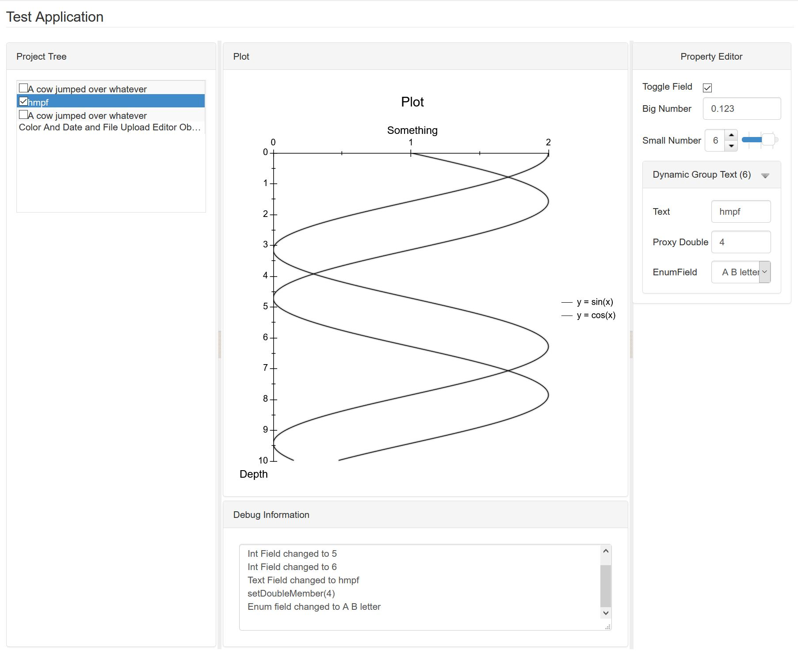

# About Caffa
Caffa is an Application Framework for Web and Desktop Applications written in C++. Caffa is based on the Qt5-based Ceetron Application Framework used in ResInsight (http://www.resinsight.org) but supports deploying to the web via the Web Toolkit (https://www.webtoolkit.eu/wt) as well as desktop deployment with Qt5, has a simplified API and supports JSON in addition to XML for serialisation.

It allows you to write applications both for desktop and cloud deployment with one code base. The main target for Caffa is to create simple control applications for embedded Linux systems with an embedded Web Interface.

As an example, you would write Data Model Objects with PdmFields holding data instead of simple variables. This gives you runtime introspection of the fields without using a pre-compiler and all objects can easily be written out to XML or JSON. Caffa is set up for allowing scripting access by utilising the introspection capabilites to optionally expose fields and objects to scripting languages with little additional work from the application developer.

```C++
class TinyDemoObject : public caf::Object
{
    CAF_HEADER_INIT;

public:
    TinyDemoObject();

private:
    caf::Field<bool>   m_toggleField;
    caf::Field<double> m_doubleField;
};
```

In the cpp file you then register the object and fields.
```C++
CAF_SOURCE_INIT(TinyDemoObject, "TinyDemoObject");

TinyDemoObject::TinyDemoObject()
{
    CAF_InitField(&m_toggleField, "Toggle", false, "Toggle Item", "", "Tooltip", " Whatsthis?");
    CAF_InitField(&m_doubleField, "Number", 0.0, "Number", "", "Enter a number here", "Double precision number");
}
```
# Requirements
Caffa uses modern C++ and requires a C++17 compatible compiler and CMake 3.12+. It requires Qt5 Core even in its web deployment mode.

# Licensing
Caffa is licensed under the LGPL 2.1. However, the Web Toolkit is licensed under the GPL v2, meaning that apps deploying to the Web will have to follow the stricter licensing terms of the GPL v2 unless you obtain a commercial license from Emweb, the developers of Web Toolkit.

# Example Screenshot

