# CAFFA Repository Architecture

This document describes the `caffa` repository as a combined codebase, including the checked-out git
submodules under `DataModel`, `DataModel/Base`, and `RestInterface/Bindings`. It is based on local source inspection only.

## Executive Summary

CAFFA is a C++20 application framework for introspected object graphs, JSON serialization, schema
generation, RPC-style client/server access, and REST exposure. Application data is modeled as classes
derived from `caffa::Object` or `caffa::Document`. Those classes register fields and methods at
construction time, and a static class-keyword factory makes the same object model available to
serializers, REST services, and remote clients.

The central architectural idea is that local and remote access share the same field/method
abstraction:

- Local server-side objects store data directly in `Field<T>`, `ChildField<T*>`, and
  `ChildArrayField<T*>`.
- Client-side proxy objects are created from the same registered classes, then their field and method
  accessors are replaced with RPC accessors.
- REST services expose documents, objects, fields, methods, sessions, and OpenAPI schemas through
  JSON.
- Python and Java bindings use the REST/OpenAPI surface to create dynamic client-side objects.

The main performance-sensitive paths are recursive object traversal, JSON serialization, per-field
REST round trips, and UUID lookup by depth-first search over all documents.

## 1. Repository And Submodule Topology

Caffa is physically split across five git repositories plus one vendored third-party tree. The
submodules allow each layer to be consumed independently, but the runtime architecture is one product.

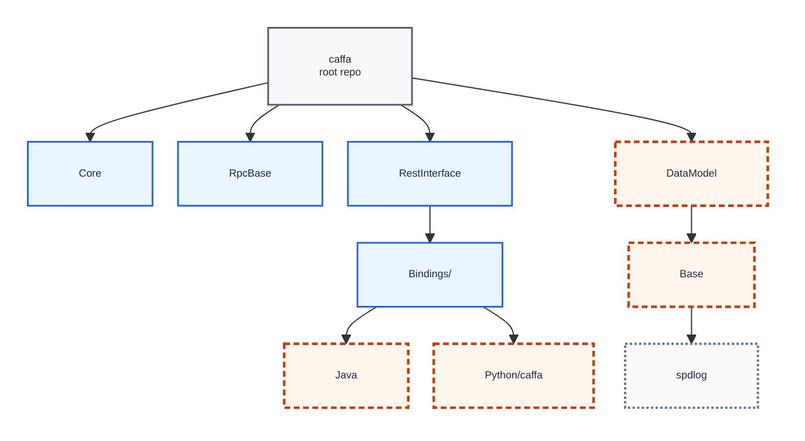

<div style="display:flex; flex-wrap:wrap; gap:10px 16px; align-items:center; margin:0.35em 0 1.2em; font-size:10px;">
  <span style="display:inline-flex; align-items:center; gap:6px;"><span style="display:inline-block; width:24px; height:14px; background:#f6f8fa; border:1.5px solid #57606a;"></span>root repository</span>
  <span style="display:inline-flex; align-items:center; gap:6px;"><span style="display:inline-block; width:24px; height:14px; background:#eaf5ff; border:1.5px solid #2563eb;"></span>in-tree directory</span>
  <span style="display:inline-flex; align-items:center; gap:6px;"><span style="display:inline-block; width:24px; height:14px; background:#fff7ed; border:2.25px dashed #c2410c;"></span>git submodule</span>
  <span style="display:inline-flex; align-items:center; gap:6px;"><span style="display:inline-block; width:24px; height:14px; background:#f8fafc; border:2px dotted #64748b;"></span>vendored dependency</span>
</div>

### Submodule Wiring

| Submodule mount point | Repository | Role |
|---|---|---|
| `DataModel` | `lindkvis/caffa-data-model` | Reflection core; added to the C++ build. |
| `DataModel/Base` | `lindkvis/caffa-base` | Shared utilities; added to the C++ build. |
| `DataModel/Base/spdlog` | `gabime/spdlog` | Vendored header-only logging dependency. |
| `RestInterface/Bindings/Java` | `lindkvis/caffa-Java` | Java binding; built by its own Gradle toolchain. |
| `RestInterface/Bindings/Python/caffa` | `Kontur-RD/caffa-python` | Python binding; packaged by its own Python toolchain. |

The C++ build includes `DataModel` and `Base`. The language bindings are checked out with the root
repository but are not compiled by the root CMake build.

---

### Build-Time Component Graph

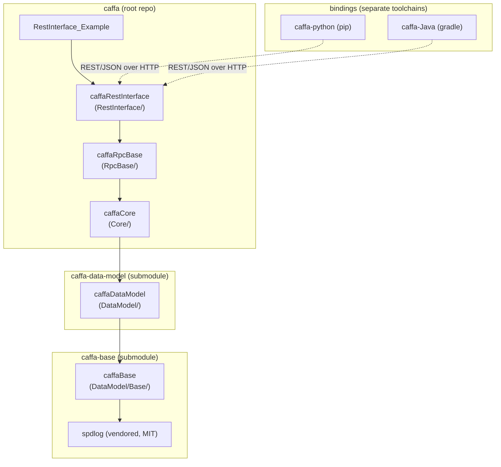

Dependency direction is strictly downward. External dependencies via vcpkg include Boost (`json`,
`beast`, `asio`, `system`, `regex`, `uuid`, `program_options`, `serialization`), OpenSSL
(non-Linux; Linux uses system OpenSSL), and GoogleTest.

## 2. Layered Architecture

| Layer | Directory / repo | Responsibility | Key external deps |
|---|---|---|---|
| **Base** | `DataModel/Base` (`caffa-base`) | Assertions, logging facade, string/UUID utilities, `not_null` | boost::regex, boost::uuid, spdlog |
| **DataModel** | `DataModel` (`caffa-data-model`) | Reflection model: `ObjectHandle`, `Field<T>`, `ChildField`, `ChildArrayField`, capabilities, factories, visitors, methods | Base |
| **Core** | `Core` (root) | Concrete `Object`/`Document`, JSON serialization (`JsonSerializer` + `FieldIoCapability`), `Method`, `Session`, `Application`, scripting capability, validators | DataModel, boost::json |
| **RpcBase** | `RpcBase` (root) | Transport-agnostic `Client`/`Server`/`ServerApplication` ABCs; remote accessors that make remote fields/methods look local; pass-by-ref/pass-by-value client object factories | Core |
| **RestInterface** | `RestInterface` (root) | Concrete REST transport: Boost.Beast HTTP(S) server, request router, services, authentication, plus C++ `RestClient` | RpcBase, boost::beast/asio/ssl |
| **Bindings** | `RestInterface/Bindings/*` | Python (`requests`) and Java (`java.net.http` + GSON) clients reproducing the remote-accessor model | HTTP/JSON |

The central design idea: the data model is defined once, and every access path - in-process, C++
client, Python, and Java - goes through the same introspection surface (`fields()`, `methods()`,
`findField()`) and the same JSON schema. Remoteness is injected by swapping a field or method
accessor for an RPC accessor at object-construction time on the client.

## 3. The Reflection Core

This is the heart of Caffa. An `Object` owns a set of `FieldHandle`s, keyed by keyword in a
`std::map`, and a set of `MethodHandle`s. Each field stores its data through a pluggable accessor and
carries a list of capabilities - IO, scripting, validation - that extend behavior without inheritance.

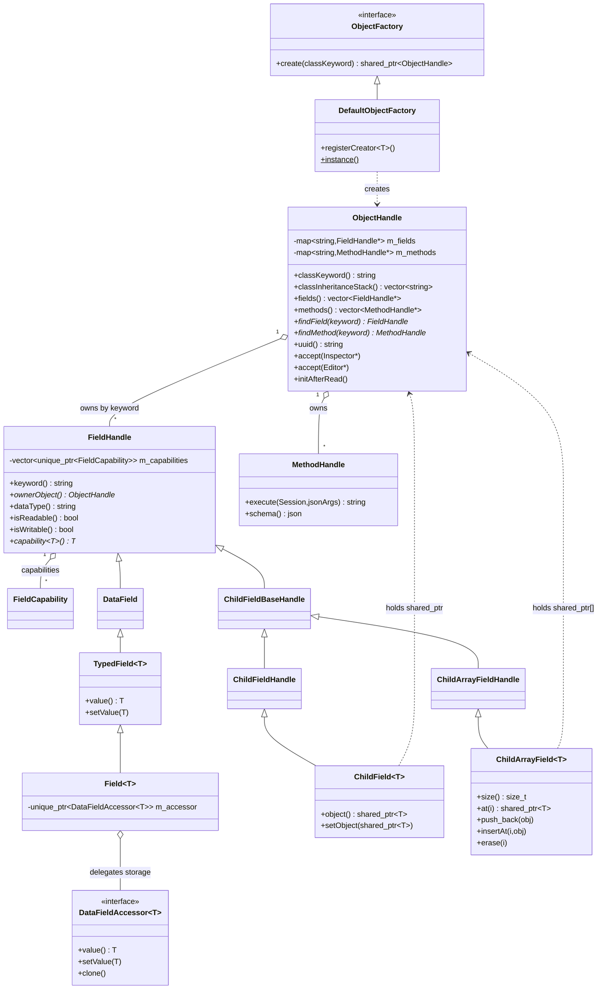

### Key Mechanisms

- **Keyword reflection.** `ObjectHandle::m_fields` and `m_methods` are
  `std::map<std::string, ...*>`. `findField()` is therefore O(log n), not a linear scan. Field
  registration happens in the constructor via `Object::initField<T>(field, "keyword")`.
- **Capability pattern.** A field is a `FieldHandle` plus a vector of `FieldCapability`.
  Capabilities are fetched by type with `capability<T>()`, an O(m) `dynamic_cast` scan over a short
  list. This is how the same `Field<double>` can be serializable, scriptable, and range-validated.
- **Accessor indirection.** `Field<T>` does not store the value directly; it holds a
  `DataFieldAccessor<T>`. The default accessor stores data in memory. On a Caffa client, the RPC
  layer swaps in a remote accessor so `field.value()` triggers a network GET. `setValue()` runs
  validators before writing.
- **Object tree.** `ChildField<T*>` and `ChildArrayField<T*>` hold `shared_ptr` values to child
  `ObjectHandle`s, forming a tree or DAG. There are no parent back-pointers in the child fields,
  avoiding ownership cycles.
- **Factory.** `DefaultObjectFactory` maps class keyword to creator and is populated by
  `CAFFA_SOURCE_INIT(Class)`. It is used during deserialization to instantiate children from their
  `"keyword"`.
- **Visitors.** `Inspector` and `Editor` walk the object tree. `ObjectCollector`, `ObjectFinder`, and
  `ObjectPerformer` are concrete depth-first visitors.

### Class-Declaration Macros

```cpp
class MyObject : public caffa::Object {
    CAFFA_HEADER_INIT(MyObject, Object)

public:
    MyObject() {
        initField(m_speed, "speed").withDefault(0.0);
        initMethod(m_stop, "stop", [this] { /* ... */ });
    }

private:
    caffa::Field<double> m_speed;
    caffa::Method<void()> m_stop;
};

CAFFA_SOURCE_INIT(MyObject)
```

`CAFFA_HEADER_INIT` declares the class keyword and inheritance-stack functions.
`CAFFA_SOURCE_INIT` registers the class with `DefaultObjectFactory`.

## 4. Serialization, Methods, And Factories

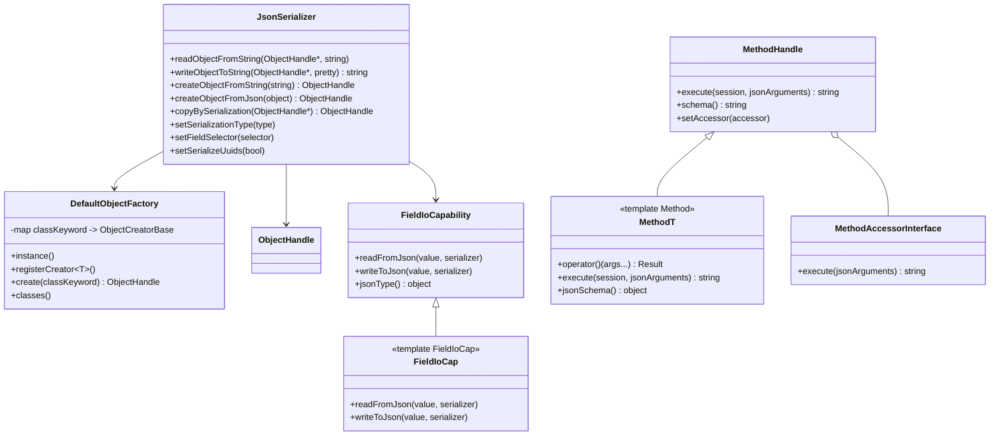

`JsonSerializer` is the single entry point for object serialization. Its modes cover full data,
skeleton data, schema generation, and path serialization. `FieldIoCap<FieldT>` specializations
provide the per-field-type read/write logic: scalar fields convert through JSON, while child fields
and child arrays recurse through the serializer and use the object factory to materialize children.

`Method<Result(Args...)>` marshals arguments to and from JSON, supports callbacks with or without a
`Session`, and can emit JSON schema. On clients, method access can be replaced by a remote
`MethodAccessorInterface` implementation.

## 5. REST Transport

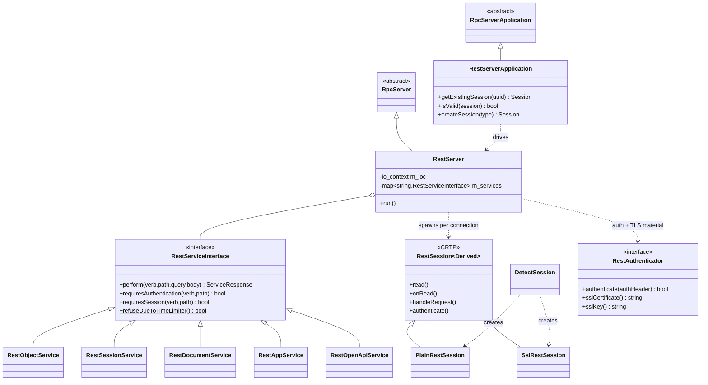

- **Transport:** Boost.Beast HTTP over Boost.Asio async I/O, optional TLS through
  `beast::ssl_stream`. `DetectSession` sniffs the first bytes to auto-select plain HTTP or TLS per
  connection. Connection handlers share code through the CRTP `RestSession<Derived>` base.
- **Routing:** the first path segment selects a service from `RestServer::m_services`: `objects`,
  `sessions`, `documents`, `app`, or `openapi`. Within `RestObjectService`, a tree of
  `RestPathEntry`/`RestAction` maps the remaining path plus HTTP verb to a handler.
- **Cross-cutting policy:** requests are gated by optional HTTP Basic authentication through the
  application-supplied `RestAuthenticator`, session validity, and a global rate limiter in
  `RestServiceInterface`.

### REST Object Surface

| Method + path | Action |
|---|---|
| `GET /objects/{uuid}/fields/{keyword}` | Read field value. |
| `PUT /objects/{uuid}/fields/{keyword}` | Replace field value. |
| `POST /objects/{uuid}/fields/{keyword}` | Insert into child-array field. |
| `DELETE /objects/{uuid}/fields/{keyword}` | Remove from child-array field. |
| `POST /objects/{uuid}/methods/{keyword}` | Execute a method. |

## 6. Interaction Diagrams

### Local Object Construction

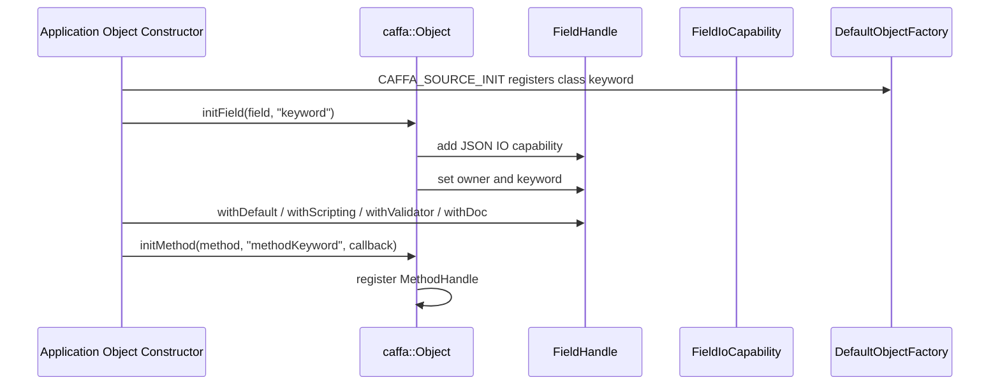

### Full JSON Serialization

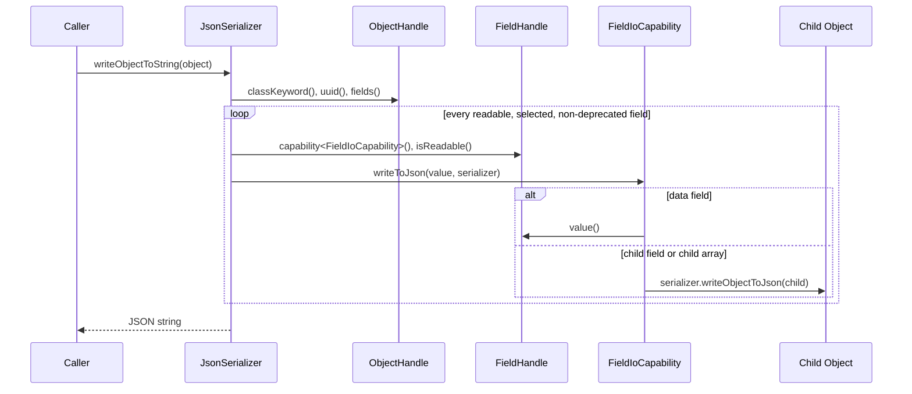

### REST Session And Document Fetch

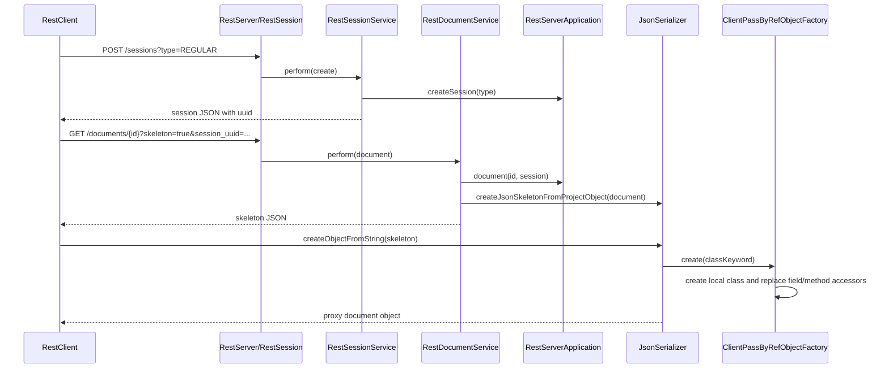

### Remote Field Read

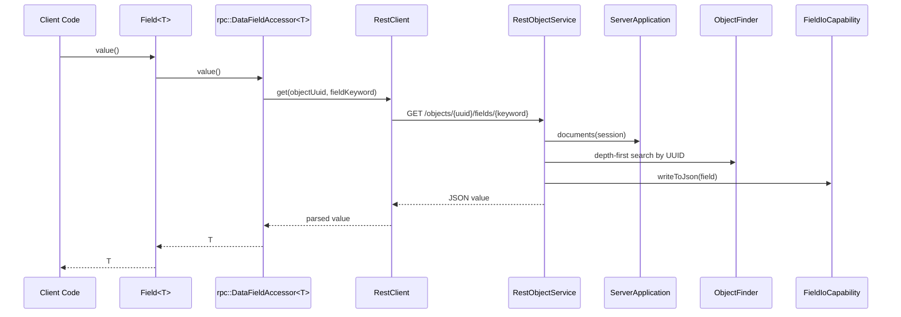

### Remote Field Write And Method Call

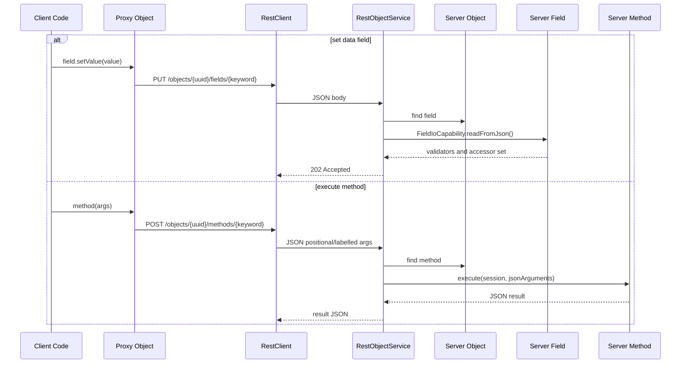

### OpenAPI Generation

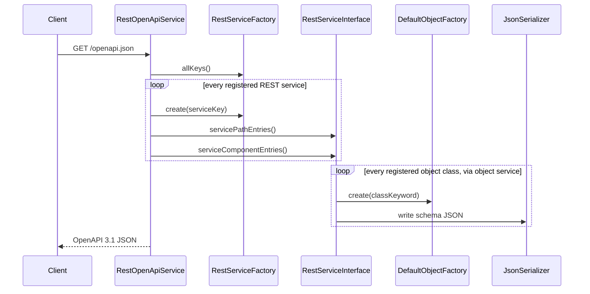

## 7. Performance Characteristics

Both source reports identified the right hot paths, but both were too detailed for an overview.
Claude's version was strongest at separating the REST read path into actual costs, especially
UUID-to-object lookup versus cheap reflection lookups. Codex's version was stronger at naming the
architectural risk areas, but it expanded each one into optimization detail that belongs in an
engineering backlog. This overview keeps only the costs that materially shape design decisions.

| Area | What matters | Evaluation |
|---|---|---|
| UUID lookup | Object requests resolve `{uuid}` by traversing session-visible documents. | This is the most important server-side scaling risk because it is O(object graph size) per field, child, or method operation. |
| Fine-grained remote fields | `Field<T>::value()` on a proxy can hide a synchronous REST call. | This is the most important client-side usability/performance risk because ordinary-looking field access can multiply network latency. |
| JSON graph serialization | Full serialization recursively walks objects and allocates Boost.JSON values before output. | This is expected and usually acceptable for persistence or snapshots, but not for high-frequency polling of large trees. |
| Child arrays | Remote child-array access can fetch skeletons and then trigger per-child field calls. | This can create multiplicative network cost unless callers batch, cache, or request fuller payloads intentionally. |
| OpenAPI/schema generation | Schema generation instantiates services and object classes. | It is mostly static after registration and should be cached if requested frequently. |
| Reflection lookup | Field lookup is map-based and capability lookup scans short vectors. | These costs are real but secondary; they are not the first optimization target unless profiling proves otherwise. |

The practical takeaway is short: prioritize UUID indexes, batched field/object APIs, clearer remote
access cost documentation, and schema caching before optimizing the reflection layer itself.

## 8. Copyright And Licensing

### Licenses In Effect

Every Caffa repository ships GNU LGPL v2.1 (`LICENSE` at root and in each submodule: `DataModel`,
`DataModel/Base`, `Bindings/Java`, `Bindings/Python`). The project descends from Ceetron's Custom
Visualization Core and remains LGPL-2.1. Embedded third-party code uses more permissive licenses:

| Third-party | Where | License |
|---|---|---|
| **spdlog** (Gabi Melman & contributors) | `DataModel/Base/spdlog/` (vendored) | MIT |
| **fmt** (Victor Zverovich) | bundled inside spdlog | MIT |
| **GSL `not_null`** (Microsoft) | `DataModel/Base/cafNotNull.h` | MIT |
| **base64** (Tobias Locker) | `Core/cafStringEncoding.cpp` | MIT |
| **Boost.Beast example code** (Vinnie Falco) | `RestInterface/cafRestServer.cpp`, `cafRestSession.*` | Boost Software License |

### Copyright Holders Observed In Source Headers

Distinct holder lines actually found in the C++ tree, with approximate counts excluding vendored
spdlog:

| Holder | Status for relicensing | Representative count |
|---|---|---|
| **Kontur AS** (`2020-`, `2021-`, `2022-`, `2023-`, `2024-`, undated) | **In-house** | ~60 lines |
| **3D-Radar AS** (`2021-`, `2021-2022`, `2023-`) | **In-house** - 3D-Radar AS is the former name of Kontur AS; legally the same entity | ~17 files |
| **Gaute Lindkvist** (`2020-2021`, undated) | **In-house**; reassignable to Kontur | 4 files |
| **Ceetron AS** (`2011-2013`, `2011-`) | **Third party**; original LGPL origin | ~15 lines |
| **Ceetron Solutions AS** (`2013-`, `2013-2022`) | **Third party** | ~9 lines |
| Microsoft / Vinnie Falco / Tobias Locker / fmt | Third party, permissive MIT or Boost Software License | per file |

For reassignment work, parts owned solely by Kontur AS and/or Gaute Lindkvist may be treated as
in-house and reassigned to Kontur AS. Because 3D-Radar AS is the former corporate name of Kontur AS,
3D-Radar copyright lines are also in-house and reassignable; they should still be normalized to
`Kontur AS` or `Kontur AS (formerly 3D-Radar AS)` to avoid ambiguity.

The remaining genuine blockers are Ceetron AS and Ceetron Solutions AS contributions. They cannot be
unilaterally relicensed without consent or clean reimplementation. Files that embed permissively
licensed third-party code can be relicensed by Kontur if the upstream notices are retained.

### Reassignability Map

This classification covers 109 first-party source files, excluding tests, examples, and vendored code,
and treats 3D-Radar AS as Kontur AS.

| Class | Count | Meaning |
|---|---:|---|
| **Clean in-house**: Kontur AS, 3D-Radar AS, and/or Gaute Lindkvist only | **68** | Reassignable to Kontur AS today. |
| **Ceetron copyright present** | **20** | Needs Ceetron consent or rewrite before relicensing. |
| **Embeds permissive third-party**: Microsoft GSL, Tobias Locker base64, Vinnie Falco Beast samples | **5** | Relicensable by Kontur if upstream notices are retained. |
| **No copyright header** | **16** | Ownership undocumented; must be resolved. |

The key issue is that `cafObjectHandle` and the `Field`/`ChildField`/`ChildArrayField` family - the
literal core of the reflection model - still carry Ceetron or Ceetron Solutions copyright. Those files
are the principal rights-clearing or rewrite focus.

### Copyright Gaps To Fill

These are the concrete gaps; resolving them is a prerequisite to clean reassignment.

1. **Java bindings: near-total absence.** Only `RestClient.java` has a header; roughly 20 Java files
   have none. They should assert ownership, likely Kontur AS if that matches project history.
2. **16 first-party C++ files with no header.** This includes pivotal reflection headers such as
   `cafObjectMacros.h`, `cafFieldHandle.h`, and `cafFieldCapability.h`, plus several Core IO headers.
   Ownership of these is undocumented until headers or other provenance records are added.
3. **Python bindings: incomplete coverage.** Several Python files and tests lack headers; headed files
   say Kontur AS but lack a year.
4. **Inconsistent attribution style.** Normalize `Kontur AS` spelling, dated versus undated notices,
   and LGPL-only versus dual GPL/LGPL header text.
5. **3D-Radar AS normalization.** The 3D-Radar files are in-house, but headers should be normalized so
   future readers do not mistake them for third-party ownership.
6. **No consolidated notice file.** Add a `NOTICE`, `CONTRIBUTORS`, or `THIRD_PARTY_NOTICES.md`
   covering spdlog, fmt, Microsoft GSL-derived `not_null`, Tobias Locker base64, Boost.Beast
   example-derived server/session code, and Gradle wrapper files.

### Ownership Summary

In-house means Kontur AS, including its former name 3D-Radar AS, plus Gaute Lindkvist. Encumbrance
means genuine third parties only.

| Component | Submodule repo | License | Primary in-house owner | Third-party encumbrance | Header coverage |
|---|---|---|---|---|---|
| Core | `lindkvis/caffa` | LGPL-2.1 | Kontur AS, including 3D-Radar | Ceetron on document/factory lineage; Tobias Locker MIT base64 | 20/26 |
| RpcBase | `lindkvis/caffa` | LGPL-2.1 | Kontur AS and Gaute Lindkvist | Ceetron client factories | 16/16 |
| RestInterface C++ | `lindkvis/caffa` | LGPL-2.1 | Kontur AS, including 3D-Radar | Vinnie Falco BSL server/session; Ceetron service factory | 25/26 |
| DataModel | `lindkvis/caffa-data-model` | LGPL-2.1 | Kontur AS, including 3D-Radar | Ceetron across the core field classes | 26/32 |
| Base | `lindkvis/caffa-base` | LGPL-2.1 | Kontur AS, including 3D-Radar logger; Gaute Lindkvist | Microsoft MIT `not_null`; spdlog/fmt MIT | 6/9 plus vendored |
| Java bindings | `lindkvis/caffa-Java` | LGPL-2.1 | Kontur AS | None identified in source ownership | 1/21 |
| Python bindings | `Kontur-RD/caffa-python` | LGPL-2.1 | Kontur AS | None identified in source ownership | 3/7 |

## 9. Architectural Risks And Recommendations

| Area | Risk | Recommendation |
|---|---|---|
| Remote object lookup | Repeated O(N) traversal by UUID for object operations. | Add UUID indexes at document/session scope. |
| Remote field granularity | Normal-looking field reads hide synchronous HTTP calls. | Add batch field/object APIs and document expected cost. |
| Child arrays | Remote array access can fetch full remote array skeletons. | Add cache/invalidation or indexed/ranged fetch. |
| OpenAPI | Schema rebuilt from services and object classes per request. | Cache schema after startup. |
| Threading | REST server can run multiple I/O threads, but document graph locking is application-defined. | Document the thread-safety contract and add locks in applications. |
| Static registration | Factory availability depends on static initializers and linked object files. | Add registration tests or explicit registration hooks. |
| Licensing split | Mixed Ceetron, Ceetron Solutions, Kontur, Gaute, and third-party files. | Build a file-level ownership matrix before moving code under new licenses. |

## 10. Conclusions

1. **One product, five repos.** The submodule split is a packaging choice; the dependency graph is a
   clean downward stack: spdlog to Base to DataModel to Core to RpcBase to RestInterface to bindings.
2. **Introspection is the spine.** Persistence, REST, scripting, and the client proxy model are built
   on the `ObjectHandle`/`FieldHandle`/capability/accessor reflection layer in `DataModel`.
3. **Transport transparency** is achieved by swapping field/method accessors for RPC accessors on the
   client; the same JSON schema serves in-process, C++, Python, and Java clients.
4. **Performance** is dominated per REST request by UUID-to-object tree resolution and JSON
   serialization allocation, not by reflection lookups. Skeleton mode and pass-by-value factories are
   the available levers.
5. **Licensing is uniformly LGPL-2.1.** With 3D-Radar AS recognized as the former name of Kontur AS,
   reassignment to Kontur is clean for roughly 68 of 109 first-party files, plus 5 that embed
   permissive MIT/BSL code. The remaining blockers are roughly 20 files carrying Ceetron or Ceetron
   Solutions copyright, 16 files with no header, and Java bindings that are almost entirely
   unattributed.
