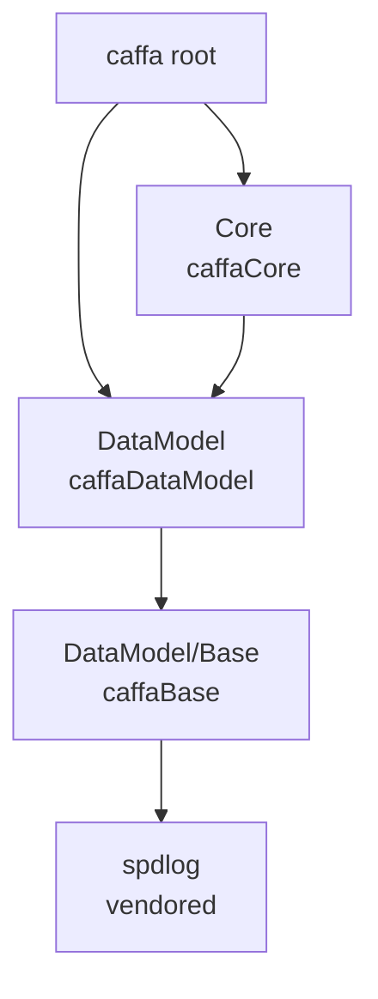
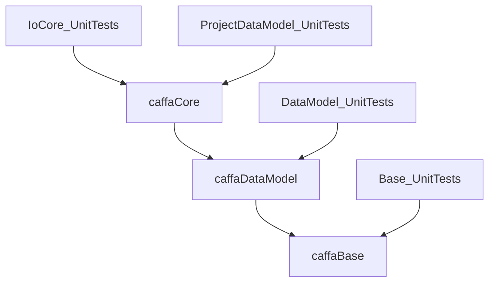
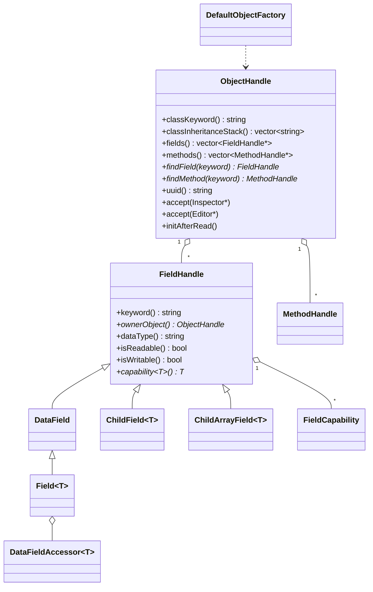
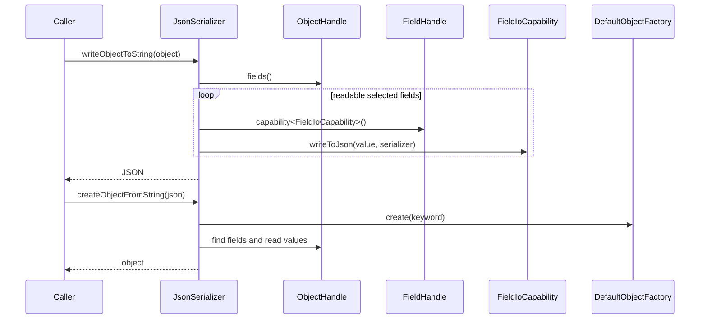
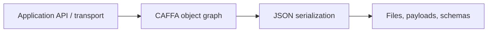

# CAFFA 2.0 Architecture

This document describes the CAFFA repository after the 2.0 scope reduction. It is based on local
source inspection only.

## Scope

CAFFA 2.0 is a C++20 library for introspection and serialization. It owns:

- Reflected object graphs.
- Fields, child fields, child arrays, capabilities, validators, and visitors.
- Object factories keyed by class keyword.
- JSON serialization, deserialization, skeleton/schema generation, and cloning.
- Local method metadata and invocation support.

CAFFA 2.0 does not own REST/RPC transport, remote accessors, C++ REST clients, Python bindings, or
Java bindings. Those pieces were part of the CAFFA 1.x framework surface and now belong in consuming
applications or separate client libraries.

## Repository Topology

```mermaid
flowchart TD
    Caffa["caffa root"]
    Core["Core<br/>caffaCore"]
    DataModel["DataModel<br/>caffaDataModel"]
    Base["DataModel/Base<br/>caffaBase"]
    Spdlog["spdlog<br/>vendored"]

    Caffa --> Core
    Caffa --> DataModel
    DataModel --> Base
    Base --> Spdlog
    Core --> DataModel
```

| Layer | Path | Responsibility |
|---|---|---|
| Base | `DataModel/Base` | Assertions, logging facade, string helpers, UUID helpers, and `not_null`. |
| DataModel | `DataModel` | Reflection primitives: `ObjectHandle`, fields, child fields, capabilities, factories, visitors, and method handles. |
| Core | `Core` | Concrete `Object`/`Document`, JSON IO, local `Method`, `Session`, `Application`, scripting capability, and validators. |

`DataModel` and `DataModel/Base` remain git submodules. Java/Python binding submodules are no longer
part of CAFFA.

## Build-Time Graph

```mermaid
graph TD
    Base["caffaBase"]
    DataModel["caffaDataModel"]
    Core["caffaCore"]
    BaseTests["Base_UnitTests"]
    DataModelTests["DataModel_UnitTests"]
    IoTests["IoCore_UnitTests"]
    ProjectTests["ProjectDataModel_UnitTests"]

    DataModel --> Base
    Core --> DataModel
    BaseTests --> Base
    DataModelTests --> DataModel
    IoTests --> Core
    ProjectTests --> Core
```

The root CMake build adds `DataModel` and `Core`. `DataModel` adds `Base`. The public CMake targets
that consumers should use are:

- `caffaBase`
- `caffaDataModel`
- `caffaCore`

There is no `caffaRestInterface` target in CAFFA 2.0.

## Reflection Core

The reflection model is centered on `ObjectHandle`. Objects own fields and methods keyed by string
keyword. Fields provide type-aware access through accessor objects and attach optional capabilities.

```mermaid
classDiagram
    class ObjectHandle {
        +classKeyword() string
        +classInheritanceStack() vector~string~
        +fields() vector~FieldHandle*~
        +methods() vector~MethodHandle*~
        +findField(keyword) FieldHandle*
        +findMethod(keyword) MethodHandle*
        +uuid() string
        +accept(Inspector*)
        +accept(Editor*)
        +initAfterRead()
    }
    class FieldHandle {
        +keyword() string
        +ownerObject() ObjectHandle*
        +dataType() string
        +isReadable() bool
        +isWritable() bool
        +capability~T~() T*
    }
    class DataField
    class Field~T~
    class ChildField~T~
    class ChildArrayField~T~
    class DataFieldAccessor~T~
    class FieldCapability
    class MethodHandle
    class DefaultObjectFactory

    ObjectHandle "1" o-- "*" FieldHandle
    ObjectHandle "1" o-- "*" MethodHandle
    FieldHandle "1" o-- "*" FieldCapability
    FieldHandle <|-- DataField
    DataField <|-- Field~T~
    FieldHandle <|-- ChildField~T~
    FieldHandle <|-- ChildArrayField~T~
    Field~T~ o-- DataFieldAccessor~T~
    DefaultObjectFactory ..> ObjectHandle
```

Important mechanisms:

- `Object::initField()` registers fields in the owning object's keyword map.
- `Object::initMethod()` registers methods in the owning object's keyword map.
- `CAFFA_HEADER_INIT` exposes class keyword and inheritance metadata.
- `CAFFA_SOURCE_INIT` registers default construction with `DefaultObjectFactory`.
- `Inspector` and `Editor` visitors traverse object graphs.
- `FieldCapability` extensions add behavior such as IO, scripting metadata, and validation without
  changing the field hierarchy.

## Serialization

`JsonSerializer` is the main serialization entry point. It walks reflected fields, delegates each
field to `FieldIoCapability`, and uses `DefaultObjectFactory` to recreate child objects during read.

```mermaid
sequenceDiagram
    participant Caller
    participant Ser as JsonSerializer
    participant Obj as ObjectHandle
    participant Field as FieldHandle
    participant Io as FieldIoCapability
    participant Factory as DefaultObjectFactory

    Caller->>Ser: writeObjectToString(object)
    Ser->>Obj: fields()
    loop readable selected fields
        Ser->>Field: capability<FieldIoCapability>()
        Ser->>Io: writeToJson(value, serializer)
    end
    Ser-->>Caller: JSON

    Caller->>Ser: createObjectFromString(json)
    Ser->>Factory: create(keyword)
    Ser->>Obj: find fields and read values
    Ser-->>Caller: object
```

Serialization modes include full data, data skeletons, schema-oriented output, and path-oriented
output. `JsonSerializer` also provides cloning by round-tripping through the serialized form.

## Methods And Sessions

`Core` still contains local method and session abstractions. They are part of the in-process object
model, not a transport contract:

- `Method<Result(Args...)>` stores typed callable metadata.
- `MethodHandle::execute()` accepts JSON arguments for local dynamic invocation.
- `Session` can be passed to method callbacks that need caller context.

Applications may use these primitives when building their own APIs, but CAFFA itself no longer
defines how remote callers reach them.

## Application Boundary

CAFFA consumers should treat the library as a local model/serialization dependency:

```mermaid
flowchart LR
    App["Application API / transport"]
    Caffa["CAFFA object graph"]
    Json["JSON serialization"]
    Storage["Files, payloads, schemas"]

    App --> Caffa
    Caffa --> Json
    Json --> Storage
```

Concrete HTTP routes, authentication, sessions exposed over the network, OpenAPI documents, and
client SDKs should be implemented outside CAFFA. The ARU server API-v2 work follows this model: the
server owns its REST contract and uses CAFFA objects for local data modeling and JSON conversion.

## Dependencies

Required dependencies for the CAFFA 2.0 root build are:

- Boost JSON
- Boost Regex
- Boost UUID headers
- GoogleTest when unit tests are enabled
- spdlog vendored under `DataModel/Base`

REST-only dependencies such as Boost.Beast, Boost.Asio, Boost.ProgramOptions, Boost.Serialization,
and OpenSSL are no longer part of the CAFFA dependency set.

## Migration Notes

Removed from the CAFFA 2.0 build surface:

- `CAFFA_REST_INTERFACE` CMake option.
- `caffaRestInterface` target.
- REST examples and REST interface unit tests.
- Java binding submodule.
- Python binding submodule.

Known follow-up cleanup for consumers:

- Remove any remaining `caffaRestInterface` links and `cafRest*` includes.
- Replace remote-accessor registration code with application-owned DTO/schema code where it is still
  present.
- Keep CAFFA usage focused on local object modeling, traversal, validation, and JSON serialization.
